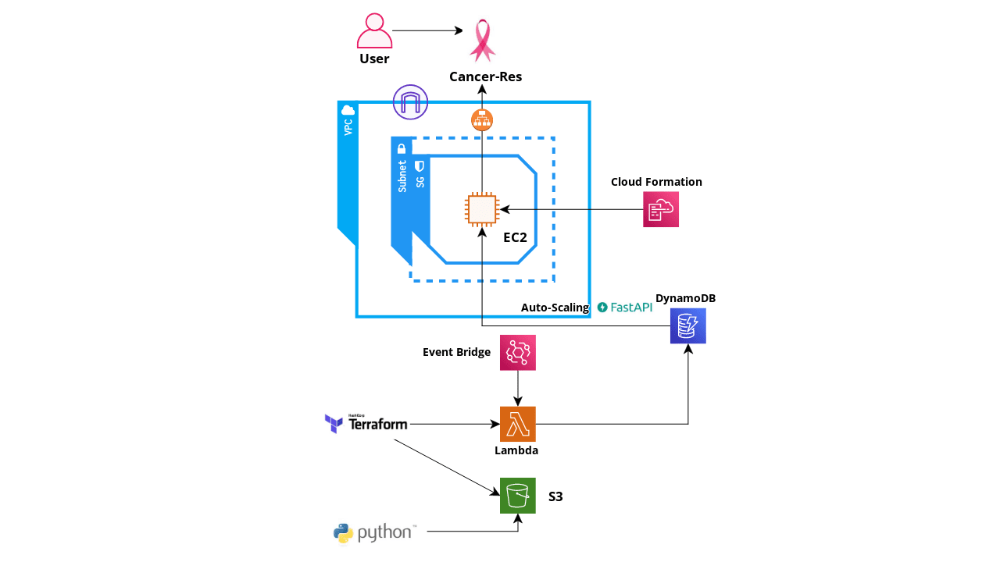

# Cancer-Res
Cancer-Res is a use case for cancer research data from the "National Cancer Institute" site where the data is fetched and saved in DynamoDb database. This data, using FastApi is displayed in an organised format in Cancer-Res website which is hosted on an EC2 instance.

## AWS Services 
- DynamoDb
- S3 Bucket
- EC2 instance 
- Lambda
- CloudWatch

## Tools
- Infrastructure as Code
  - Terraform
  - AWS Cloud Formation
- FastApi

 

------------------------------------
 

